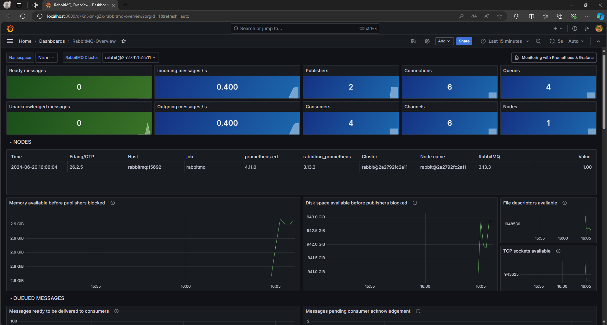
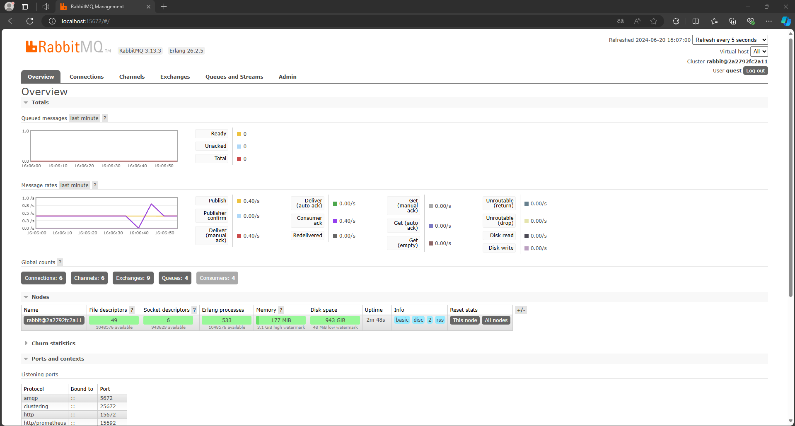
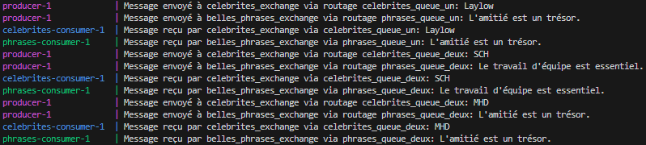

# Projet de Messagerie avec RabbitMQ, Prometheus et Grafana

## Concept
Nous avons un producer qui envoie sur 2 échanges différents et 2 queues differentes, sur le premier échangé envoie une liste de phrase, et sur le deuxième échange il envoie une liste de chanteurs français.

Bien évidemment, nous avons 2 consumers (un qui consomme les phrases et l'autre les chanteurs), chacun consomme sur 2 queue différentes.

## Prérequis

- Docker
- Docker Compose

## Installation

1. Clone ce dépôt :
   ```sh
   git clone https://github.com/mardev60/rabbitmq_tp
   cd rabbitmq_tp

2. Démarre les services Docker :
   ```sh
   cd rabbitMQ_project
   docker-compose up -d --build

3. Accès aux interfaces :

- RabbitMQ Management : http://localhost:15672
    - Utilisateur : guest
    - Mot de passe : guest

- Prometheus : http://localhost:9090

- Grafana : http://localhost:3000
    - Utilisateur : admin
    - Mot de passe : admin


## Structure du projet
```bash
rabbitmq_tp/
├── rabbitMQ_project/
│   ├── docker-compose.yml
│   ├── prometheus.yml
│   ├── rabbitmq/
│   │   └── rabbitmq.conf
│   ├── grafana/
│   │   ├── provisioning/
│   │   │   ├── datasources/
│   │   │   │   └── datasource.yaml
│   │   │   ├── dashboards/
│   │   │   │   └── dashboard.yaml
│   │   └── dashboards/
│   │       └── rabbitmq-dashboard.json
│   ├── src/
│       ├── producers/
│       │   ├── celebrites.ts
│       │   └── producer.ts
│       ├── consumers/
│       │   ├── celebrites-consumer.ts
│       │   └── phrases-consumer.ts
│       └── config/
│           └── index.ts
├── screenshots/
│   └── exemple.png
│   └── grafana.png
│   └── rabbitmq.png
└── Rapport de conception.pdf
```

## Screenshots
### Grafana


### RabbitMQ


### Exemple de logs
